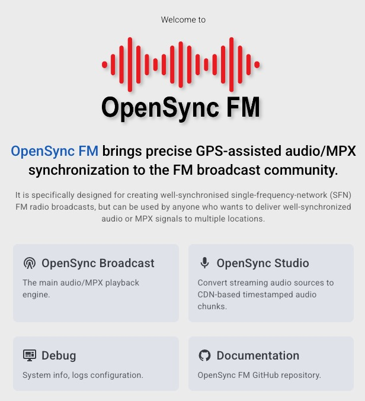
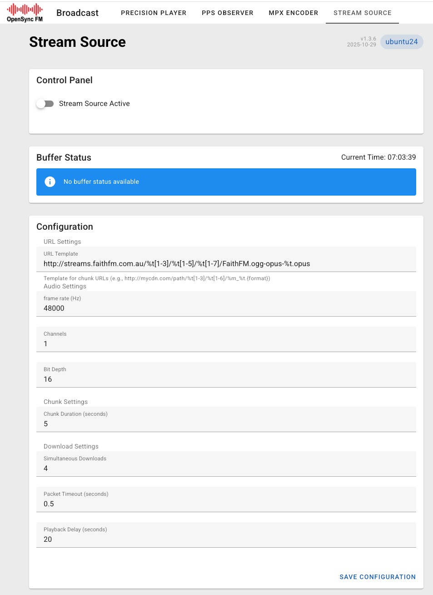
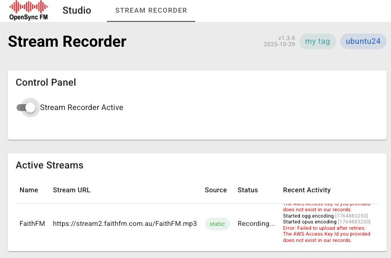
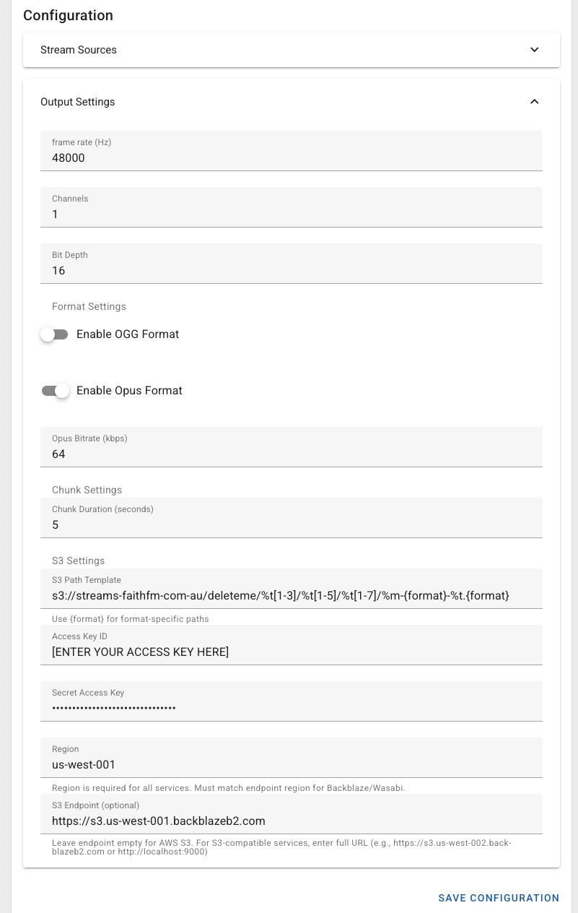

# OpenSync FM - docker app deployment

[](https://opensource.org/licenses/MIT)
[](https://github.com/faithfm/OpenSyncFM/pulls)


**OpenSync FM** brings precise GPS-assisted audio/MPX synchronization to the FM radio broadcasting community.

It is specifically designed for creating well-synchronised single-frequency-network (SFN) FM radio broadcasts, but can be used by anyone who wants to deliver well-synchronized audio or MPX signals to multiple locations.

Note: SFN's require precise audio synchronisation of broadcast signals to the sub-millisecond level.  Typical computer architectures and audio player engines are not designed with precision and repeatability in mind. 

## Architecture

OpenSync FM is a docker app having two modes of operation:

### OpenSync Broadcast

This is the main precision playback engine.  It plays an OpenSync-style segmented audio stream - typically from a CDN.  This is designed to run on Raspberry Pi Model 4B devices.  Precision GPS synchronisation was designed for use with the "HiFiBerry DAC2 ADC Pro" sound card.

### OpenSync Studio

Converts an Icecast Stream to an OpenSyncFM-style segmented audio stream - streaming it to an S3-compatible CDN bucket.  This should be compatible with a broad range of Linux systems (both cloud and physical hardware), but has primarily been developed with Ubuntu and Raspberry Pi OS targets in mind.

## Installation

```bash
# Create user/group with matching UID/GID for the container
sudo groupadd -g 901 opensyncfm
sudo useradd -u 2001 -g opensyncfm opensyncfm
sudo usermod -a -G audio opensyncfm             # ensure opensyncfm user is in audio group
sudo usermod -a -G opensyncfm $USER             # ensure current user can access opensyncfm storage folder

# (restart your shell session before continuing)

# Create storage folders
sudo mkdir -p /opensyncfm/logs
sudo mkdir -p /opensyncfm/debug
sudo chown -R opensyncfm:opensyncfm /opensyncfm       # ownership
sudo chmod -R g+w,g+s /opensyncfm                     # group write permissions, setgid ensures new files inherit group

# Configure firewall ports   (IF UFW INSTALLED)
sudo ufw allow 4000

# Install docker
curl -fsSL https://get.docker.com -o get-docker.sh
sudo sh get-docker.sh
sudo usermod -aG docker $USER

# install 'osfm' helper script
sudo curl -fsSL https://raw.githubusercontent.com/faithfm/opensync-fm/master/osfm -o /usr/local/bin/osfm
sudo chmod 755 /usr/local/bin/osfm

# optionally configure a system tag to identify this system
echo '{ "system-tag": "my tag" }' > /opensyncfm/meta.json

# use the helper script to pull and start the OpenSync docker app
osfm pull
osfm restart

```

## Configuration

OpenSync FM should now be running and accessible on port 4000 - ie: 
> http://mydevice.local:4000




### OpenSync Broadcast

Our main Faith FM OpenSync stream can be used to test if the basics are working.  Apply the following in Broadcast > Stream Source > URL template:

> ```http://streams.faithfm.com.au/%t[1-3]/%t[1-5]/%t[1-7]/FaithFM.ogg-opus-%t.opus```



Save configuration then toggle "Stream Source Active", then confirm that audio segments are being downloaded.

Adjust some precision player settings:

* Broadcast > Precision Player > Audio Device = "bcm2835 Headphones"
* Broadcast > Precision Player > Channel 1 (left) = "STREAM"
* Broadcast > Precision Player > Channel 2 (right) = "PPS"

Save configuration then toggle "Precision Player Active".  If everything is working you should hear the Faith FM audio stream in the left channel, and a 1 PPS click in the right channel.

Note: the "HiFiBerry DAC+ADC Pro HiFi multicodec-0" device is required for precision GPS synchronised MPX signals.  Instructions not yet documented.


### OpenSync Studio

OpenSync Studio will not normally be used on the same hardware as your broadcast device(s) - ie: a cloud server or hardware in a central location with a good internet connection.

> Note: You'll need write access to an S3-compatible block storage bucket as an output for OpenSync Studio.

Our main Faith FM icecast stream can be used to test if the basics are working:

* Studio > Stream Recorder > Stream Sources > + Add Stream
* Studio > Stream Recorder > Stream Sources > Static Streams > Stream URL = "https://stream2.faithfm.com.au/FaithFM.mp3"
* Studio > Stream Recorder > Stream Sources > Static Streams > Name = "FaithFM"
* Studio > Stream Recorder > Stream Sources > Dynamic Streams > Icecast Server = <BLANK>

Save configuration then toggle "Sream Recorder Active".  A log of encoding attempts should start, although you'll get a output + upload errors because no output bucket has been configured.  



Now stop the "Stream Recorder Active" and configure output settings using your S3-compatible bucket.  I've included a screenshot of a configuration we tested using a Backblaze B2 bucket, but you'll need to use your own details here.

> Note: We have found that 64kbps Opus streams provide sufficient quality for our purposes at Faith FM.



Note that the **Studio** > Stream Recorder > Output Settings > **S3 Path Template**  that was used in this sample:
> ```s3://streams.faithfm.com.au/deleteme/%t[1-3]/%t[1-5]/%t[1-7]/%m-{format}-%t.{format}```

Coresponds to the following **Broadcast** > Stream Source > **URL template** that would be used in your OpenSync Broadcast units:
> ```https://s3.us-west-001.backblazeb2.com/streams-faithfm-com-au/deleteme/%t[1-3]/%t[1-5]/%t[1-7]/FaithFM-opus-%t.opus```


## Troubleshooting: DNS issue with UTM Virtual Machine

Note: When testing this on a Ubuntu 24.04 Virtual Machine running on UTM, docker was not passing a valid nameserver to containers, and all DNS lookups were failing.  Applying this fix to the VM worked:

```bash
sudo mkdir -p /etc/docker

cat << 'EOF' | sudo tee /etc/docker/daemon.json
{
  "dns": ["8.8.8.8", "1.1.1.1"]
}
EOF

sudo systemctl restart docker
```

